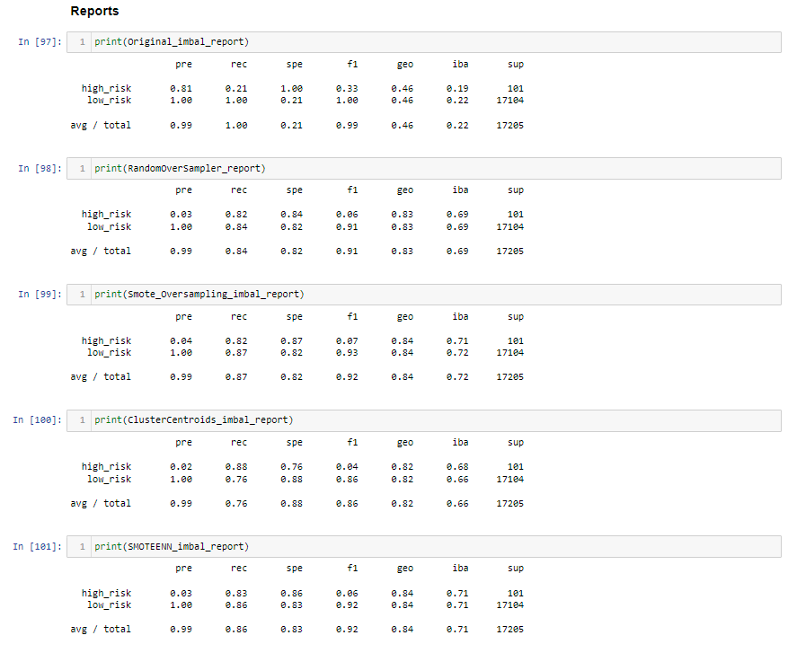
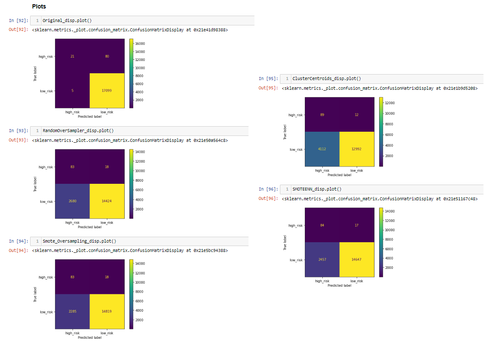
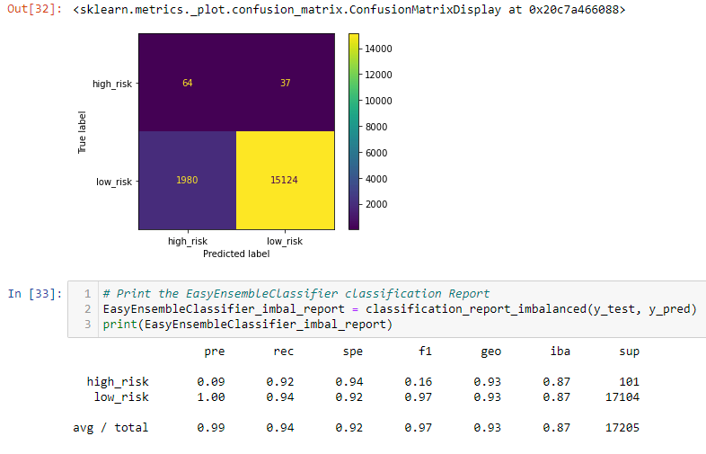

# Credit_Risk_Analysis

## Overview of the Analysis 
Using the credit card credit dataset from LendingClub, a peer-to-peer lending services company, we oversampled the data using the RandomOverSampler and SMOTE algorithms, and undersampled the data using the ClusterCentroids algorithm. Then, we used a combinatorial approach of over- and undersampling using the SMOTEENN algorithm. Next, we compared two new machine learning models that reduce bias, BalancedRandomForestClassifier and EasyEnsembleClassifier, to predict credit risk. Now that we are finished, we will evaluate the performance of these models via a written recommendation on whether they should be used to predict credit risk. 

Deliverable 1: Use the Resampline Models to predict credit risk 
Deliverable 2: Use the SMOTEENN Algorithm to predict credit risk 
Deliverable 3: Use Ensemble Classifiers to predict credit risk 
Deliverable 4: A written report on the credit risk analysis 

## Results 

### Deliverable 1 
The following steps have been taken for the Random Over Sample, the SMOTE, and the Cluster Centroids Models: 
 - An accuracy score for the model was calculated 
 - A confusion matrix was generated 
 - An imbalanced classification report was generated 

### Deliverable 2
The following steps have been taken for the SMOTENN Algorithm Models: 
 - An accuracy score for the model was calculated 
 - A confusion matrix was generated 
 - An imbalanced classification report was generated 

### Deliverable 1 & 2 Results 
For this we put together an overview of the confusion matrix and imbalanced classification reports. The presentation value allows for the reader to see and compare models with ease. As an added bonus we also presented a model and report before we ran any of the prediction models for comparison's sake.  
 

 

### Deliverable 3 
The following steps have been taken for the Ensemble Classifiers Algorithm Models: 
 - An accuracy score for the model was calculated 
 - A confusion matrix was generated 
 - An imbalanced classification report was generated 

 Here is the matrix and report for the Ensemble Classifier Model 
 

## Summary 
Because the data showed an overwhelming amount of "low risk" loans (17,000+), while the "high risk" loans were at closer to 300 total, most of the results were inclusive. The over sampling models did allow for us to tip the scales back into the realm of possibilities of analysis, but still the results were hard to read. From this data, we might say it was safe to lend money to the "low risk" categories. It is hard to say much else.  